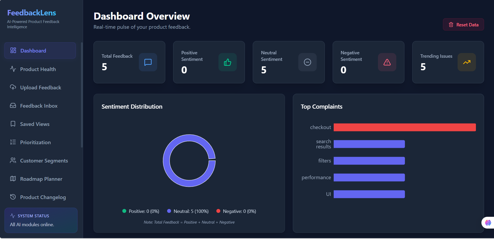
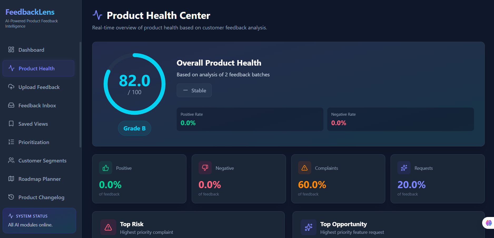
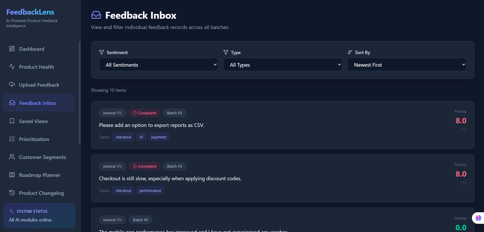
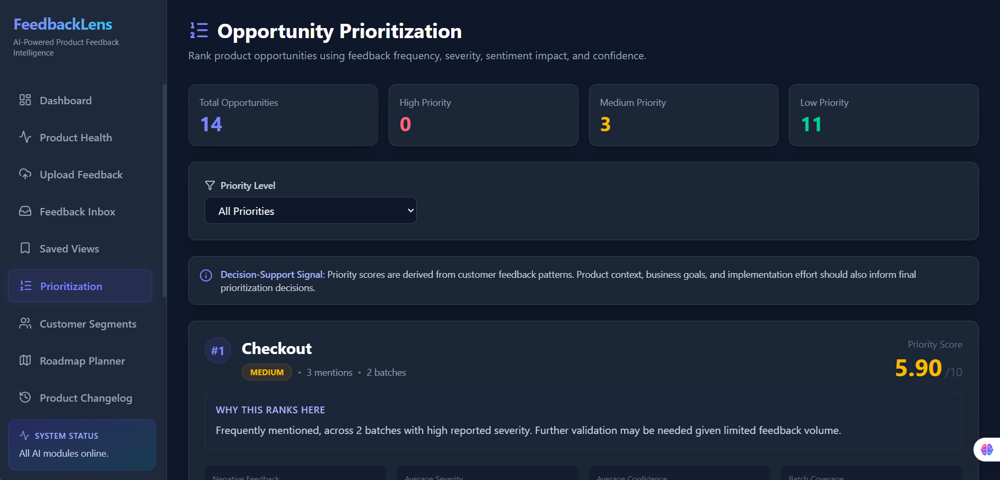
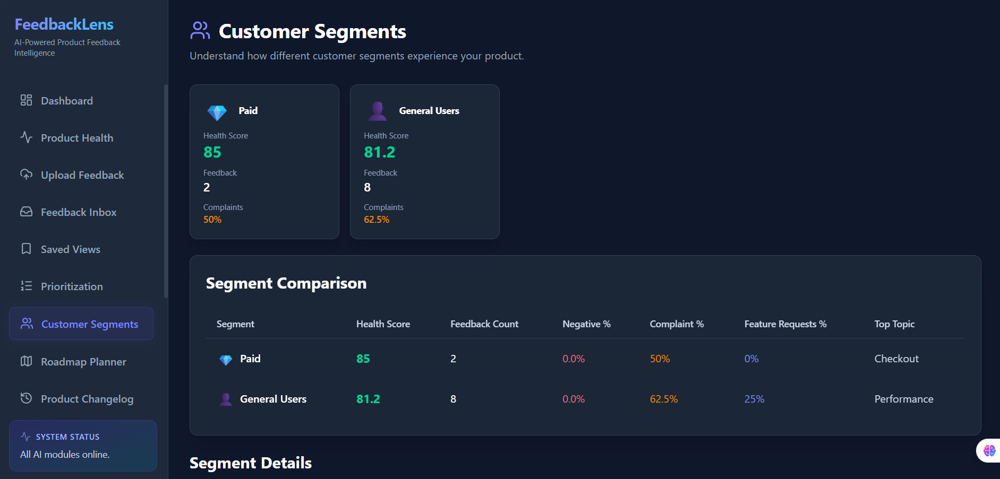
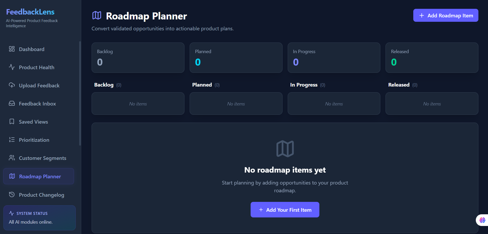
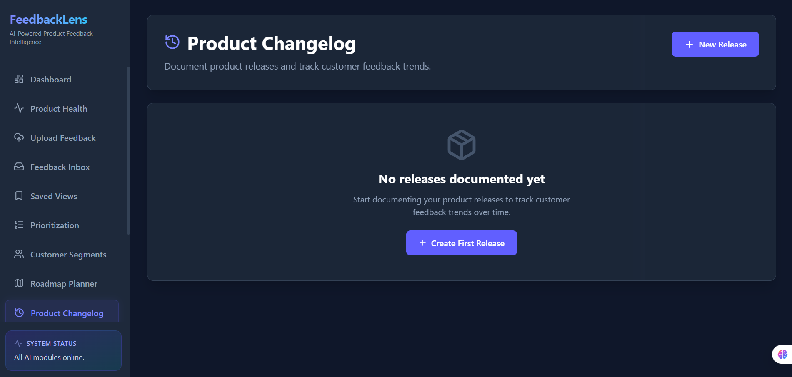

# FeedbackLens

**An AI-assisted product intelligence workspace that helps Product Managers turn customer feedback into confident product decisions.**

Every product team collects customer feedback, but collecting it is rarely the challenge. The real challenge is understanding what customers are consistently struggling with, deciding which problems deserve attention, and measuring whether product decisions actually improve the user experience.

FeedbackLens is a Product Management project built around that workflow. It transforms raw customer feedback into structured product insights, helping Product Managers investigate recurring issues, prioritize opportunities, document decisions, validate releases, and track product health from a single workspace. Rather than replacing product judgment, FeedbackLens is designed to organize evidence so that decisions are more transparent, consistent, and easier to justify.


## The Problem

Customer feedback is one of the most valuable inputs into product strategy, yet it is often scattered across support tickets, app reviews, surveys, community forums, and customer interviews. While these sources capture what users experience, turning thousands of individual comments into actionable product decisions remains a largely manual process.

Product Managers need to identify recurring problems, understand which issues affect the largest number of customers, balance competing requests, and justify prioritization decisions with evidence. In practice, this often means switching between spreadsheets, dashboards, and notes while manually searching for patterns.

Most feedback tools focus on collecting or analyzing comments. Few support the complete decision-making workflow that follows—moving from raw feedback to prioritized opportunities, documented decisions, release validation, and continuous product improvement.

FeedbackLens was designed to bridge that gap by treating customer feedback not as isolated comments, but as evidence that supports every stage of the product decision process.


## Product Approach

FeedbackLens is built around a simple principle: every important product decision should be supported by customer evidence.

Instead of treating feedback as individual comments, the platform organizes customer signals into a structured product workflow. Similar issues are grouped into opportunities, opportunities are prioritized using transparent scoring signals, and each decision remains connected to the customer feedback that supports it.

The objective is not to automate product management. Prioritization, trade-offs, and roadmap decisions remain the responsibility of the Product Manager. FeedbackLens provides the context, evidence, and historical record needed to make those decisions with greater confidence.


## Product Workflow

FeedbackLens follows the same workflow a Product Manager would use when evaluating customer feedback.

1. **Collect Feedback** – Import customer feedback from surveys, support tickets, app reviews, or other sources into a single workspace.

2. **Identify Patterns** – Analyze feedback to understand sentiment, recurring topics, complaints, and feature requests. Similar feedback is grouped into opportunities instead of remaining as isolated comments.

3. **Prioritize Opportunities** – Rank opportunities using transparent signals such as customer frequency, complaint rate, sentiment impact, and confidence. This helps distinguish widespread product problems from isolated feedback.

4. **Make Product Decisions** – Investigate supporting evidence, document decision rationale, and track the status of each opportunity from investigation through implementation.

5. **Measure Outcomes** – Compare customer feedback before and after releases to understand whether product changes reduced customer pain points and improved the overall product experience.

Rather than treating customer feedback as a reporting exercise, FeedbackLens turns it into a continuous product decision workflow.


## Application Screenshots

### Dashboard

Provides an executive overview of customer feedback, sentiment distribution, trending issues, and product metrics.



### Product Health Center

Calculates an overall product health score using customer feedback trends, complaint rate, feature requests, and historical comparisons.



### Feedback Inbox

Browse every feedback item with filters for sentiment, feedback type, topics, and automatically calculated priority scores.



### Opportunity Prioritization

Ranks product opportunities using AI-assisted scoring based on frequency, severity, confidence, and business impact.



### Customer Segments

Analyze how different customer groups experience the product and compare health metrics across user segments.



### Roadmap Planner

Convert validated customer opportunities into actionable roadmap items for product planning.



### Product Changelog

Track releases and visualize how customer feedback evolves across multiple product versions.




## Core Capabilities

### Feedback Intelligence

Customer feedback is transformed into structured product data through sentiment analysis, topic extraction, complaint detection, and feature request identification. Instead of reading every individual comment, Product Managers can quickly understand the themes emerging across large volumes of feedback.

### Opportunity Discovery & Prioritization

Recurring customer problems are automatically grouped into product opportunities and ranked using deterministic signals such as frequency, complaint rate, and sentiment impact. This helps teams focus on problems with the greatest customer impact instead of reacting to isolated requests.

### Evidence-Based Decision Making

Every opportunity includes supporting customer evidence, allowing Product Managers to investigate issues before making prioritization decisions. Decisions can be documented alongside the evidence that influenced them, creating a transparent record of product thinking over time.

### Roadmap & Release Validation

Validated opportunities can be promoted into roadmap initiatives and tracked throughout delivery. After each release, FeedbackLens compares customer feedback before and after deployment, helping teams understand whether product changes actually improved the customer experience.

### Product Monitoring

The platform provides a consolidated view of overall product health, customer segments, release history, and executive summaries. This allows Product Managers to monitor trends over time without switching between multiple reporting tools.


## Product Decisions

Throughout the project, I intentionally prioritized features that support a Product Manager's day-to-day workflow rather than adding capabilities simply because they were technically interesting.

For example, I introduced an evidence-backed opportunity prioritization system before building advanced filtering because understanding **what deserves attention next** is a more valuable product problem than making existing data easier to browse.

Similarly, the Decision Center was designed to capture the reasoning behind product decisions, not just their outcomes. Product decisions often outlive the people who made them, so preserving context becomes just as important as tracking implementation status.

I also chose to keep prioritization transparent. Rather than relying entirely on AI-generated recommendations, FeedbackLens combines deterministic signals such as customer frequency, complaint rate, and sentiment with AI-assisted analysis. This makes every prioritization decision easier to understand, explain, and challenge.

These decisions reflect the philosophy behind the product: AI should accelerate product thinking, not replace it.


## How FeedbackLens Works

FeedbackLens follows the same workflow that many Product Managers already use, but replaces scattered spreadsheets and manual analysis with a single, structured workspace.

A Product Manager starts by importing customer feedback collected from sources such as support tickets, surveys, app reviews, or user interviews. FeedbackLens processes each response, identifies recurring themes, detects complaints and feature requests, and groups similar feedback into opportunities.

Instead of reviewing hundreds of individual comments, the PM sees a prioritized list of customer problems backed by real evidence. Each opportunity includes the supporting feedback, customer sentiment, complaint frequency, and priority signals, making it easier to understand both the scale and the impact of an issue.

Once an opportunity has been investigated, it can move into the Decision Center, where product decisions are documented together with the evidence that justified them. Validated opportunities can then be promoted into the Roadmap Planner, allowing customer feedback to flow naturally into product planning.

After a release is shipped, FeedbackLens compares customer feedback collected before and after the release to measure whether the intended outcome was achieved. Finally, Product Health dashboards and Executive Reports provide an ongoing view of product performance and customer sentiment, helping teams continuously evaluate whether their product decisions are improving the customer experience.


## Core Product Workflow

FeedbackLens is designed around the workflow a Product Manager follows after receiving customer feedback—not around isolated features.

```text
Collect Feedback
        ↓
Understand Customer Problems
        ↓
Identify Product Opportunities
        ↓
Prioritize What Matters Most
        ↓
Investigate Supporting Evidence
        ↓
Document Product Decisions
        ↓
Plan the Roadmap
        ↓
Validate Release Outcomes
        ↓
Monitor Product Health
```

Instead of jumping between spreadsheets, dashboards, support tools, and documents, FeedbackLens keeps the entire decision-making process in one place. Every opportunity can be traced back to the original customer feedback, making prioritization more transparent and evidence-driven.


## Key Product Capabilities

### Feedback Intelligence

Transform unstructured customer feedback into structured product insights. FeedbackLens analyzes sentiment, identifies recurring topics, detects complaints and feature requests, and organizes customer feedback into information that Product Managers can act on.

### Opportunity Prioritization

Recurring customer problems are consolidated into ranked product opportunities using transparent prioritization signals, including customer frequency, complaint volume, sentiment impact, and confidence. The goal is to help Product Managers focus on problems with the highest customer impact instead of reacting to isolated requests.

### Decision Management

Every prioritization decision can be documented alongside the supporting customer evidence. This creates a shared decision history that explains not only *what* was decided, but *why* it was decided.

### Roadmap Planning

Validated opportunities can be promoted into roadmap initiatives and tracked through their lifecycle—from Backlog to Released. This creates a direct connection between customer feedback and product execution.

### Release Validation

Measure whether product releases achieved their intended outcome by comparing customer feedback before and after each release. Rather than assuming success, Product Managers can validate improvements using changes in customer sentiment, complaint trends, and recurring topics.

### Product Health Monitoring

Monitor the overall health of the product through customer sentiment, complaint trends, opportunity backlog, customer segments, and release performance. This provides a single view of product health instead of relying on multiple disconnected reports.


## Product Design Decisions

Building FeedbackLens required making deliberate product trade-offs rather than simply adding more features. Throughout the project, I focused on designing a workflow that supports how Product Managers actually make decisions.

One of the earliest decisions was to prioritize **evidence over automation**. Instead of asking AI to recommend what should be built next, FeedbackLens surfaces customer signals such as frequency, complaint rate, sentiment, and supporting feedback, allowing Product Managers to make the final prioritization based on both data and business context.

Another important decision was to treat every opportunity as traceable. Product decisions should never become black boxes. Every prioritized opportunity can be investigated, linked back to the original customer feedback, documented in the Decision Center, promoted into the roadmap, and later evaluated after release. This creates a continuous record of **problem → decision → outcome**.

I also intentionally avoided adding features that increased complexity without improving the core workflow. The objective was not to build the largest feedback platform, but to build a focused workspace that helps Product Managers move from customer feedback to product decisions with greater confidence.


## How I Would Measure Success

If FeedbackLens were launched as a real product, I would evaluate it using product outcomes rather than feature usage alone.

**Adoption**

* Number of active Product Managers using the platform each week.
* Percentage of customer feedback processed through FeedbackLens instead of manual workflows.

**Decision Quality**

* Percentage of roadmap initiatives linked to supporting customer evidence.
* Average time required to investigate and prioritize a product opportunity.

**Product Outcomes**

* Change in customer sentiment after releases.
* Reduction in recurring complaints for prioritized opportunities.
* Percentage of releases that demonstrate measurable improvement based on customer feedback.

**User Experience**

* Time taken to move from raw feedback to a documented product decision.
* Satisfaction of Product Managers with the prioritization workflow.

These metrics focus on whether FeedbackLens helps teams make better product decisions, rather than simply measuring clicks or page views.


## Technology Stack

Although FeedbackLens is presented as a Product Management case study, I also built the working prototype to validate the product concept.

**Frontend**

* React
* TypeScript
* Tailwind CSS
* Vite
* Framer Motion
* Recharts

**Backend**

* FastAPI
* SQLAlchemy
* SQLite

**AI & Machine Learning**

* TF-IDF + Logistic Regression for sentiment classification
* OpenAI API for topic extraction, complaint detection, and feature request identification
* Deterministic scoring model for opportunity prioritization

The technology choices were intentionally lightweight. The focus of this project was not exploring complex infrastructure, but building a functional product that demonstrates product thinking, evidence-driven decision making, and end-to-end workflow design.


## Getting Started

### Prerequisites

* Python 3.10+
* Node.js 18+
* OpenAI API Key

### Backend

```bash
cd backend

python -m venv .venv

# Windows
.venv\Scripts\activate

# macOS / Linux
source .venv/bin/activate

pip install -r requirements.txt

# Create .env
OPENAI_API_KEY=your_api_key

python main.py
```

The backend will start on **http://localhost:8000**

---

### Frontend

```bash
cd frontend

npm install

# Create .env
VITE_API_BASE_URL=http://localhost:8000

npm run dev
```

The frontend will start on **http://localhost:5173**

---

### Demo Workflow

1. Upload a customer feedback dataset.
2. Review the generated insights in the Feedback Inbox.
3. Explore prioritized opportunities.
4. Investigate supporting evidence.
5. Document a product decision.
6. Move validated opportunities into the roadmap.
7. Compare releases using Release Impact Analysis.
8. Monitor Product Health over time.


## Portfolio Context

FeedbackLens was built as a Product Management portfolio project to explore how customer feedback can be transformed into structured product decisions.

Rather than focusing on individual features, I approached the project by designing an end-to-end workflow that reflects how Product Managers work in practice—from identifying customer problems to prioritizing opportunities, documenting decisions, planning roadmap initiatives, and validating releases.

Throughout the project, I made intentional trade-offs to keep the product focused. Instead of maximizing the number of features, I prioritized clarity, traceability, and evidence-based decision making. Every major capability exists to support a specific step in the product lifecycle.

While the current version is a working prototype, there are many directions I would explore in a production environment, including collaboration features, integrations with support platforms, user authentication, richer analytics, and longitudinal product health tracking.

The goal of this project is not to present a perfect product, but to demonstrate how I think about product strategy, prioritization, user workflows, and building solutions around real customer problems.
